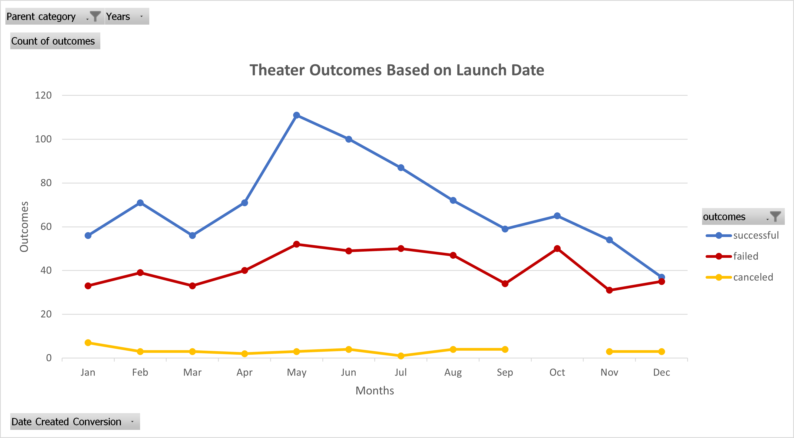

# Kickstarting with Excel

## Overview of Project

### Purpose
The purpose of this project is to use the Kickstarter data to analyze and visualize the Theater Campaigns Outcomes and how they progressed in relation to their Launch Date and the Play Campaigns Funding Goals.

## Analysis and Challenges
### Analysis of Outcomes Based on Launch Date
The Kickstarter data were filtered by the Parent Category Theater and its corresponding Launch Date Year. The values used were the number of campaigns grouped by their Outcomes: Successful, Failed, and Canceled and by the Months of the Year. Then the Outcomes were sorted in descending order.

Here is the pivot table used for the analysis:

Here is the line chart used for analysis:

### Analysis of Outcomes Based on Goals
The Kickstarter data were filtered by the Subcategory Play. The values used were the number of campaigns listed by their Outcomes: Successful, Failed, and Canceled. It was then grouped by Goals in dollar-amount ranges. The percentage of each outcome was then calculated for each row.

Here is the table used for the analysis:

Here is the line chart used for analysis:

### Challenges and Difficulties Encountered

## Results

- What are two conclusions you can draw about the Outcomes based on Launch Date?

- What can you conclude about the Outcomes based on Goals?

- What are some limitations of this dataset?

- What are some other possible tables and/or graphs that we could create?

