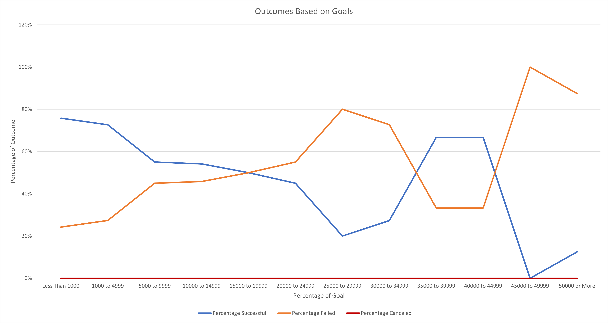

# Kickstarting with Excel

## Overview of Project

### Purpose

The purpose of this project is to use the Kickstarter dataset to analyze and visualize the Theater Campaigns Outcomes and how they progressed in relation to their Launch Date and the Play Campaigns Funding Goals.

## Analysis and Challenges

### Analysis of Outcomes Based on Launch Date
The Kickstarter dataset were filtered by the Parent Category Theater and its corresponding Launch Date Year. The values used were the number of campaigns grouped by their Outcomes: Successful, Failed, and Canceled and by the Months of the Year. Then the Outcomes were sorted in descending order.

Here is the pivot table used for the analysis:

Here is the line chart used for analysis:

### Analysis of Outcomes Based on Goals
The Kickstarter dataset were filtered by the Subcategory Play. The values used were the number of campaigns listed by their Outcomes: Successful, Failed, and Canceled. It was then grouped by Goals in dollar-amount ranges. The percentage of each outcome was then calculated for each row.

Here is the table used for the analysis:

Here is the line chart used for analysis:

### Challenges and Difficulties Encountered
The most challenging part of the assignment is setting up the COUNTIF formula to display the Goal values in dollar-amount ranges for the Subcategory Play and by each Type of Outcome. It required strong attention to detail to make sure that the formula has the correct criteria.  It was also difficult not to overthink when interpreting the graphs. Knowing that the Kickstarter dataset has other fields that could affect the results it was tough to stay focused only on such limited information.

## Results

### Conclusions about the Outcomes Based on Launch Date
It appears that certain months in the year provide a higher outcome. Spring to the end of Summer provides the most results. The month of May sees the highest return in data. In December, there are not enough campaigns to quantify. The canceled campaigns stayed low throughout the year but with the highest number of cancellations in January and no cancellations in October.
The number of successful campaigns and failed campaigns are correlated. The canceled campaigns have no relation and did not impact the number of successful and failed campaigns.

### Conclusion about Outcomes Based on Goals
The percentage of successful campaigns and failed campaigns are inversely proportionate. The higher the goal, the higher risk of failure. It is important to note the goal range of $35,000 to $44,999 where the successful campaign rate is consistently twice as higher as the failed campaigns rate. However, there are much fewer campaigns launched within this goal. The campaigns with a goal of below $5000 were the most successful.

### Limitations of Dataset
The dataset used is only a small fraction of what is available. It is difficult to draw a reliable conclusion on how different campaigns performed in relation to their launch dates and their funding goals.

### Other Possible Tables and/or Graphs
It would be helpful to also to do an analysis of Theater’s other subcategories campaigns: Musical and Spaces. We will have a more reliable conclusion if we also look at the outcomes based on goals for each subcategory.
